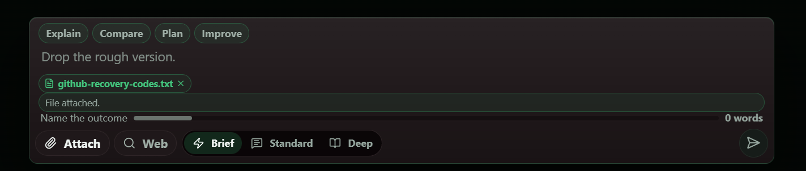
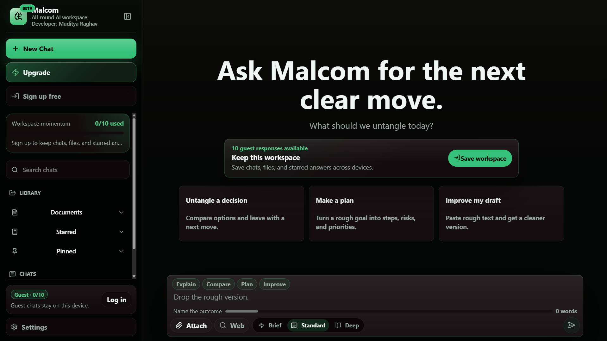
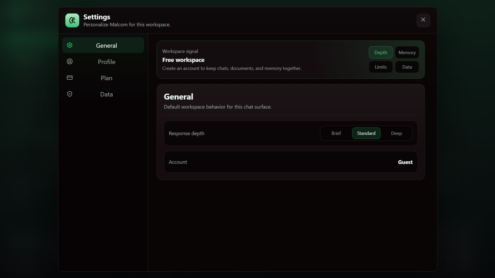
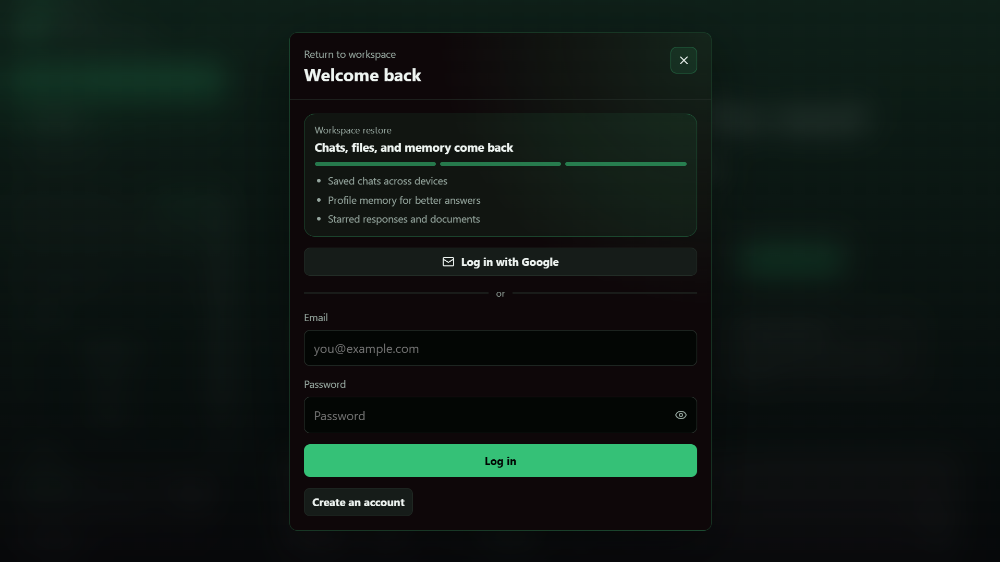
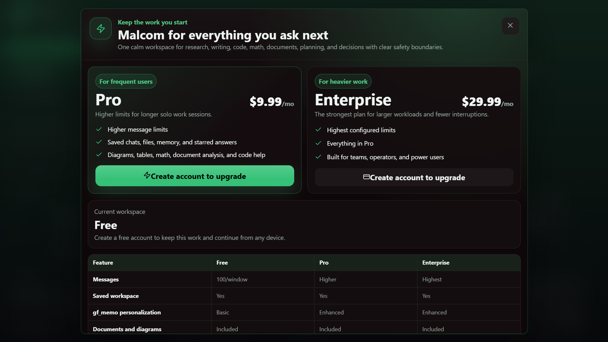

<div align="center">

<h1>Malcom</h1>

**An all-round AI research assistant for streamed conversations, document RAG, web research, and long-form analysis.**

[Live app](https://malcom-lake.vercel.app) | [System status](https://malcom-lake.vercel.app/status)

<p>
<a href="LICENSE"></a>
<a href="https://github.com/0xMudit/malcom-research-assistant"></a>


</p>



</div>

---

## Why Malcom

- **Streamed responses.** Real-time token streaming with Brief, Standard, and Deep modes for different depth requirements.
- **Web research built in.** Optional web research with source collection and inline citations.
- **Document-grounded answers.** Upload documents and get context-aware responses from your own materials.
- **Rich output.** Supports Markdown, tables, fenced code, Mermaid diagrams, and KaTeX math rendering.
- **Production-ready auth and billing.** Supabase Auth, guest mode, Stripe Checkout, customer portal, and webhook-synced subscriptions.
- **Resilient by design.** SQLite fallback when Supabase is unavailable, DuckDuckGo keyless research, optional Redis caching, and isolated billing until configured.
- **Organized workspace.** Saved chats, folders, tags, pinned sessions, starred answers, and profile memory persist across sessions.

## Features

| Area | What you get |
| --- | --- |
| **Chat** | Streamed conversations with mode selector (Brief/Standard/Deep), message history, and persistent sessions. |
| **Web research** | Keyless research with collected sources and citations rendered in responses. |
| **Document context** | Upload and reference documents in the conversation with context-aware grounding. |
| **Rich formatting** | React Markdown with GFM, KaTeX for math, and Mermaid for diagrams. |
| **Authentication** | Supabase email/password with server-side sessions, plus guest mode for quick trials. |
| **Workspace management** | Saved chats, folders, tags, pinning, starring answers, and persistent profile memory. |
| **Storage** | Supabase/Postgres primary with local SQLite fallback for offline/development resilience. |
| **Billing** | Stripe Checkout, customer portal, webhook handling, and subscription state synchronization. |
| **Admin tools** | Workflows for access requests, feedback, usage tracking, and account operations. |
| **Health & ops** | Public /status endpoint, robots metadata, sitemap generation, and smoke tests. |

## Screenshots

| | |
|---|---|
|  |  |
| **Workspace** — saved chats, folders, tags, pinned sessions, and starred answers organized in one place. | **Settings** — account, usage, billing, and privacy controls from a unified panel. |
|  |  |
| **Login** — server-side session handling resumes your workspace where you left off. | **Pricing** — Free, Pro ($9.99/mo), and Enterprise ($29.99/mo) via Stripe Checkout. |

## Requirements

- **Node.js 20+** with npm
- **(Optional) Supabase project** — if not configured, the app falls back to local SQLite for persistence.
- **(Optional) Stripe account** — required only for paid plans and billing flows; disabled gracefully if not configured.
- **(Optional) Redis** — caching is optional and not required for local development.

## Quick start

```bash
# 1. Clone
git clone https://github.com/0xMudit/malcom-research-assistant.git
cd malcom-research-assistant

# 2. Install dependencies
npm install

# 3. Configure environment (optional)
cp .env.example .env.local 2>/dev/null || true
# Edit .env.local as needed. See Configuration below.

# 4. Run in development
npm run dev

# 5. Open the app
# http://localhost:3000
```

## Configuration

Set environment variables in `.env.local` as required. Core variables shown; see repo docs for complete set.

| Variable | Purpose |
| --- | --- |
| `NEXT_PUBLIC_APP_URL` | Public base URL (e.g. https://malcom-lake.vercel.app) |
| `NEXT_PUBLIC_SUPABASE_URL` | Supabase project URL (optional; SQLite fallback used if absent) |
| `NEXT_PUBLIC_SUPABASE_ANON_KEY` | Supabase anonymous key (optional) |
| `SUPABASE_SERVICE_ROLE_KEY` | Service role key for server operations (optional) |
| `DATABASE_URL` | Database connection string (optional; SQLite used by default) |
| `STRIPE_SECRET_KEY` | Stripe secret key (optional; billing disabled if missing) |
| `STRIPE_WEBHOOK_SECRET` | Stripe webhook signing secret (optional) |
| `REDIS_URL` | Redis connection URL (optional) |
| `OLLAMA_BASE_URL` | Ollama-compatible endpoint base URL |
| `ENABLE_GUEST_MODE` | Enable guest access (default behavior as configured) |

## How it works

```
+-------------------------------------------------------------------------+
¦ Malcom (Next.js 16 App Router, React 19, TypeScript)                   ¦
+-------------------------------------------------------------------------¦
¦ Renderer (React) --? App Router (server actions/routes) --? AI runtime ¦
+-------------------------------------------------------------------------+
                               ¦        ¦                ¦
                               ?        ?                ?
                            Supabase   SQLite (local)   Ollama-compatible
                            (primary)  (fallback)      chat endpoint
                               ¦        ¦                ¦
                               +--------+----------------+
                                        ?
                                      Stripe (billing, optional)
                                        ¦
                                        ?
                                     Web research (DuckDuckGo, keyless)
```

Malcom streams responses from an Ollama-compatible chat endpoint, augments context with uploaded documents and optional web research, and persists chats/workspaces to Supabase or SQLite. Billing flows route through Stripe Checkout and webhooks with customer portal access.

## Project layout

```text
app/              # Next.js App Router routes and pages
components/       # React UI components
lib/              # Utilities, auth, db, types, helpers
public/           # Static assets
scripts/          # Build/ops utilities (smoke, verify, schema)
docs/             # Documentation and screenshots
__tests__/        # Vitest tests
```

## Scripts

| Script | What it does |
| --- | --- |
| `npm run dev` | Start development server (Next.js) |
| `npm run build` | Build for production |
| `npm run start` | Start production server |
| `npm run lint` | Run ESLint |
| `npm test` | Run Vitest tests |
| `npm run smoke` | Run smoke tests |
| `npm run verify:build-assets` | Verify built assets |
| `npm run supabase:apply-schema` | Apply Supabase schema |

## Contributing

See [CONTRIBUTING.md](CONTRIBUTING.md) if present in the repository for contribution guidelines.

## Security

See [SECURITY.md](SECURITY.md) if present in the repository for security reporting.

## License

[MIT](LICENSE)

© 2025 [0xMudit](https://github.com/0xMudit)
